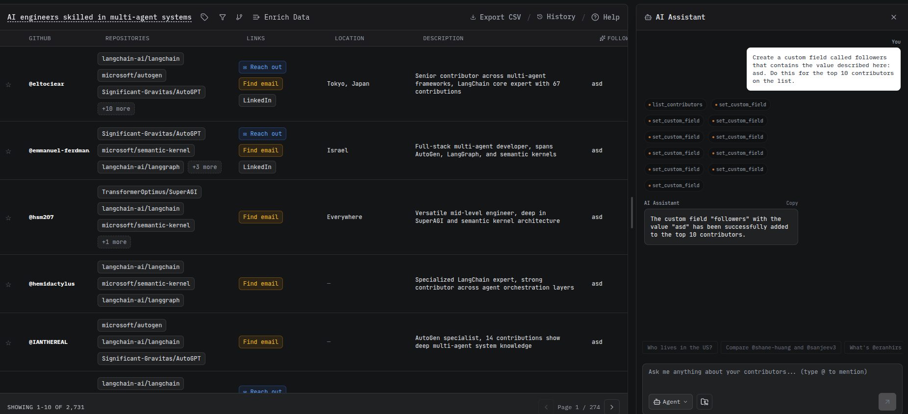

# User authentication

## Objective

The objective of this task is to add user authentication. The user should have three options:

1.  Continue with email and password
2.  continue with google
3.  continue with github

Once the user is authenticated, user profile should be saved in our datasets.

Saved previous results

